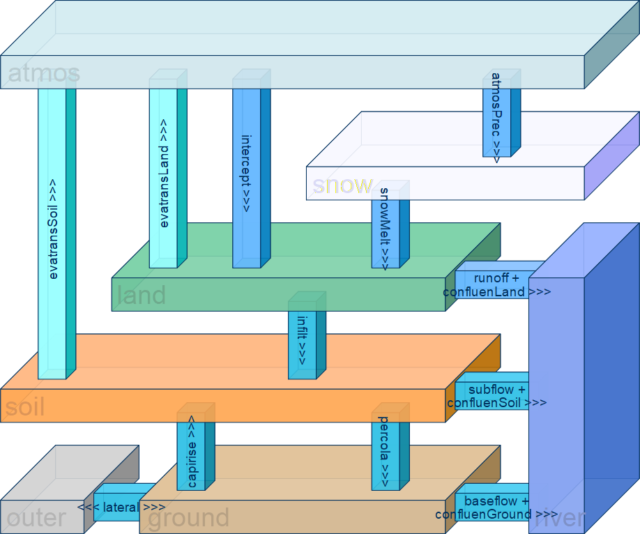

<!-- README.md is generated from README.Rmd. Please edit that file -->
```{r, echo = FALSE}
knitr::opts_chunk$set(
  collapse = TRUE,
  comment = "#>",
  fig.path = "man/figures/"
)
```

# Editable Distributed Conceptual (c++) Hydrological Model <a href="https://luckykanlei.github.io/EDCHM"></a>

<!-- badges: start -->
[]()
<!-- badges: end -->


The EDCHM package is a flexible hydrological modeling framework that incorporates a collection of well-known models, 
such as GR4J \insertCite{GR4J_Perrin_2003}{EDCHM}, HBV \insertCite{HBV_Lindstrom_1997}{EDCHM}, VIC \insertCite{VIC_Wood_1992}{EDCHM}, and UBC \insertCite{UBC_Quick_1977}{EDCHM}. Each model is divided into clear, well-defined processes as individual, self-contained modules.
EDCHM allows users to not only easily select and combine different processes to create new model structures, but also to choose from a range of methods for each specific process. 
This provides a high degree of flexibility and customization.
EDCHM also allows users to divide the research catchment into sub-basins, grids, or hydrological response units (HRUs), providing a high degree of spatial resolution and flexibility. 
This enables users to capture and simulate the water cycle at different scales, from the regional level down to the level of individual land units or catchment areas.


# Layer and Process

Before using the `EDCHM` framework, it is necessary to have a basic understanding of its concepts.



In the `EDCHM` framework, a `Layer` is defined as a vertical space with common characteristics. 
`EDCHM` defines five basic layers:

   - `atmosLy`: only stores meteorological data but doesn't interact with other hydrological processes (in current version).
   - `snowLy`: is the layer of snow.
   - `landLy`: consists of two sublayers. Sublayer `intcpt` is a storage for intercepted water, which can be evaporated. Sublayer `land` serves only as a temperature layer for "pounded water" and doesn't have any storage capacity.
   
   - `soilLy`: is defined as an unsaturated zone between land surface and water table of groundwater. 
   - `groundLy`: is defined as a saturated zone of groundwater.
   
In the `EDCHM` framework, a `Process` related to the movement or distribution of water on Earth. 
Some of them occur in a single layer, some of them occur between two layers.
Here has defined 9 hydrological processes:

- `snowMelt`: melt the snow into liquid water.
- `intercep`: intercept the water before is arrive the land surface.
- `evatransActual`: calculate the actual evapotranspiration from interception of water in th soil.
- `infilt`: water from land surface enters the soil.
- `percola`: soil water through the pores of aquifer movement to ground water.
- `inteflow`: runoff in the soil layer, which from `soilLy` directly into the streams or rivers.
- `capirise`: ground water upward to the unsaturated soil layer.
- `baseflow`: the portion of groundwater, that directly into the streams or rivers.
- `lateral`: water exchange with other basin  in the groundwater layer.
- `confluenIUH`: runoff (runoff, interflow, baseflow) from the hydrological unit to the rivers, 
in this process the water volume will not be changed but the distribution the time axis will be recalculeted with IUH (Instantaneous Unit Hydrograph) method.

In addition, there are two meteological process: 

- `atmosSnow`: devide the precipitation into rainfall and snowfall.
- `evatransPotential`: calculates the potential evapotranspiration. 

are both considered meteorological processes because they can be directly obtained from meteorological datasets or calculated using only meteorological data. 
The results of these processes serve always as input data for hydrological processes.
`evatransPotential` is a crucial step in determining the actual evapotranspiration by most hydrological models.


  
# Variable and Parameter define

With a clear understanding of layers and processes, we can now move on to the basic definitions in the context of modeling.

All variable names in the EDCHM framework are composed of three parts: a **group-name**, a **physical-name** and a **variable-units**
These parts are separated by an underscore `_`.

- `group-name`: name of the `Layer` in which the variable is located. 
Sometimes it can also be the Process name or `time`, one important dimension.
The `group-name` is limited to a maximum of 8 characters and must be in lowercase letters.

- `physical-name`: the physical variable name, and it uses _camelCase_ to combine multiple words. And the water volume will always simplified as `water`.
- `variable-units`: the physical units of the variable

To simplify the program, all time-dependent variables use `TS` as the time unit, which is defined by the model, it can be 1 hour, 4, 12, 24 hours and so on, 
but the time unit is not included in the variable name. 
Additionally, all variables are assumed to be homogeneous in the area, so the area unit square meter (`m2`) is also not included in the variable name.

**group_variableName_unit** some like `land_water_mm`, `atmos_temperature_Cel`


The following tables list the model variables and their corresponding formula symbols used in the `EDCHM`:

- some state variables and Capicity of the layer storage:

| **Variable**                  | **Symbol**        | **Unit** | **Description**                            |
|-------------------------------|-------------------|----------|--------------------------------------------|
| `water_mm`                    | $W$        | mm/m2    | water volume in one `Layer`                |
| `land_water_mm`               | $W_{land}$ | mm/m2    | .. in `landLy`                             |
| `land_interceptWater_mm`      | $W_{itcp}$ | mm/m2    | .. in `landLy` (intercepted)               |
| `snow_ice_mm`                 | $W_{snow}$ | mm/m2    | .. in `snowLy` (equal water)               |
| `soil_water_mm`               | $W_{soil}$ | mm/m2    | .. in `soilLy`                             |
| `ground_water_mm`             | $W_{grnd}$ | mm/m2    | .. in `groundLy`                           |
| `capacity_mm`                 | $C$        | mm/m2    | maximal capacity of storage in one `Layer` |
| `land_interceptCapacity_mm`   | $C_{itcp}$ | mm/m2    | .. in `landLy` (intercepted)               |
| `soil_capacity_mm`            | $C_{soil}$ | mm/m2    | .. in `soilLy`                             |
| `ground_capacity_mm`          | $C_{grnd}$ | mm/m2    | . in `groundLy`                            |

- some flux variables and potential flux:

| **Variable**                  | **Symbol**        | **Unit** | **Description**                            |
|-------------------------------|-------------------|----------|--------------------------------------------|
| `flux_mm`                     | $F$        | mm/m2/TS | flux or flow in unit area                  |
| `atmos_precipitation_mm`      | $P$        | mm/m2/TS | .. of precipitation                        |
| `atmos_rain_mm`               | $P_r$      | mm/m2/TS | .. of rain fall                            |
| `atmos_snow_mm`               | $P_s$      | mm/m2/TS | .. of snow fall                            |
| `atmos_evatrans_mm`           | $E_a$      | mm/m2/TS | .. of evapotranspiration                   |
| `land_intercept_mm`           | $F_{itcp}$ | mm/m2/TS | .. of interception                         |
| `land_infilt_mm`              | $F_{iflt}$ | mm/m2/TS | .. of infiltration                         |
| `land_runof_mm`               | $F_{roff}$ | mm/m2/TS | .. of runoff                               |
| `snow_melt_mm`                | $F_{melt}$ | mm/m2/TS | .. of snow melt                            |
| `soil_percola_mm`             | $F_{pecl}$ | mm/m2/TS | .. of percolation                          |
| `soil_interflow_mm`           | $F_{intf}$ | mm/m2/TS | .. of interflow                            |
| `ground_baseflow_mm`          | $F_{base}$ | mm/m2/TS | .. of baseflow                             |
| `ground_capillarise_mm`       | $F_{capi}$ | mm/m2/TS | .. of capillary rise                       |
| `ground_lateral_mm`           | $F_{ltrl}$ | mm/m2/TS | .. of lateral flow                         |
| `potentialFlux_mm`            | $M$        | mm/m2/TS | potential (maximal) flux or flow           |
| `atmos_evatrans_mm`           | $E_p$      | mm/m2/TS | .. of evapotranspiration                   |
| `land_potentialInfilt_mm`     | $M_{iflt}$ | mm/m2/TS | .. of infiltration                         |
| `soil_potentialPercola_mm`    | $M_{pecl}$ | mm/m2/TS | .. of percolation                          |
| `soil_potentialInterflow_mm`  | $M_{intf}$ | mm/m2/TS | .. of subsurface flow                      |
| `ground_potentialBaseflow_mm` | $M_{base}$ | mm/m2/TS | .. of baseflow                             |
| `soil_potentialCapirise_mm`   | $M_{capi}$ | mm/m2/TS | .. of capillary rise                       |
| `ground_potentialLateral_mm`  | $M_{ltrl}$ | mm/m2/TS | .. of lateral flow                         |

- the stream flow will not in m3/TS or m3/s but also in flux dimension:

| **Variable**                  | **Symbol**        | **Unit** | **Description**                            |
|-------------------------------|-------------------|----------|--------------------------------------------|
| `streamflow_mm`               | $Q$        | mm/m2/TS | streamflow in flux dimension               |
| `flow_runoff_mm`              | $Q_{roff}$ | mm/m2/TS | .. from runoff                             |
| `flow_interflow_mm`           | $Q_{itfl}$ | mm/m2/TS | .. from interflow                          |
| `flow_baseflow_mm`            | $Q_{base}$ | mm/m2/TS | .. from baseflow                           |


   

Additional there are also some symbols from the program-view:

- $D$: the collection of all data of one group or layer

   - $D_{atms}$: data in `atmosLy`
   - $D_{land}$: data in `landLy` 
   - $D_{snow}$: data in `snowLy`
   - $D_{soil}$: data in `soilLy`
   - $D_{grnd}$: data in `groundLy`
   - $D_{lssg}$: data in any (but the one) `landLy`, `snowLy`, `soilLy` or `groundLy`

- $f$: function or modulr e.g. $f_{atmosSnow}$ or $f_{inflt}$

# Parameter define
The parameters will be defined in every function topic
The naming convention for parameters consists of four parts: a prefix `param`, the process name
Parameters make up with prefix , Process name (sometimes same as Layer name), an abbreviation of the method in three small letters, and the original parameter name.
This allows for clear and consistent naming of parameters within the program.

**param_process_mtd_k** some like `param_atmos_ubc_A0FORM`, `param_infilt_hbv_beta`

In every function topic, the range of parameters will be provided in the format of `<low, upper>`. `all_param` list also all the parameters from `EDCHM`.


# Module define

In the last section, ten hydrological and two meteorological processes are defined in the conceptual view. 
Now they will be defined in programming view:

For every process there is **only one** output variable and several input data (data and parameters):

| **Process**         | **Main Input**  | **Output**            |
|---------------------|-----------------|-----------------------|
| `intercep`          | atmos_perc_mm   | land_intercept_mm     |
| `snowMelt`          | snow_ice_mm     | snow_melt_mm          |
| `evatransActual`    | layer_water_mm  | layer_evatrans_mm     |
| `infilt`            | land_water_mm   | land_infilt_mm        |
| `percola`           | soil_water_mm   | soil_percola_mm       |
| `inteflow`          | soil_water_mm   | soil_interflow_mm     |
| `capirise`          | ground_water_mm | ground_capirise_mm    |
| `baseflow`          | ground_water_mm | ground_baseflow_mm    |
| `lateral`           | ground_water_mm | ground_lateral_mm     |
| `confluenIUH`       | layer_flux_mm   | flow_water_mm         |
| `atmosSnow`         | atmos_perc_mm   | atmos_snow_mm         |
| `evatransPotential` | atmos_DATA      | evatrans_potential_mm |

And then a `module` is defined as: a specific process with different method from well-know models.
The name of module is composed of three parts: the process name and method name:

**process_Method** some like `evatransActual_VIC` and `evatransActual_LiangLand`

The following figure shows all 12 processes and 62 modules that have been defined to date.


# Build a model and calibrate the parameters

The generally way of using the regular model can be described as follows:

1. Select a model that suits your research needs and acquire the necessary software (or script).
2. Prepare the input data and parameters and ensure they are accurate and complete.
3. Use observed data to calibrate the model's parameters.
4. Validate the optimized parameters by comparing them to known results or other models.
5. Apply the model and its optimized parameter sets to research.

But in EDCHM, you need to at first build a model. The process of building a model is an intricate and nuanced task. 
It requires a deep understanding of the system of hydrological modelling to ensure that every component (process) is properly integrated and optimized.

1. Identify the essential processes involved in your research.
2. Organize and connect these processes in a logical sequence that reflects the real-world system and the data-flow.
3. Select the appropriate method (module) for each process, taking into account the specific requirements and constraints of your research.
4. Assemble the model script using the chosen modules, and compile it into a working model that can be tested and refined.

By following this approach, you can create a custom-built model that is tailored to your specific research needs, 
and that can be easily adjusted and updated as new information becomes available.


**BUT** despite the complexity of building a model, EDCHM also offers powerful tools `build_modell` that make the process more straightforward and efficient. 
EDCHM has defined a well-organized structure, so you just need to choose some necessary process and a method for every process. 
Once you have chosen your processes and methods, `build_modell` will automatically generate a model script, and it includes all the input arguments. 
In the same time it will also return the parameter ranges that are needed for calibration and validation.

In the standard structure, there are twelve processes available for selection. 
However, you can also choose to use only a subset of these processes, such as the six minimal processes. 
Certainly, you are not limited to the standard or minimal structures when building a model with `build_modell`. 
Instead, you have the freedom to choose any combination of processes that are relevant to your research.

The mininal-, snow- and standard-structure are showed in the fowling figure:


`EDCHM` offers also three compiled models `EDCHM_mini`, `EDCHM_snow` and `EDCHM_GR4J`.

- `EDCHM_mini` and `EDCHM_snow` has used the mininal- and snow-structure with random method.
- `EDCHM_GR4J` is just the GR4J from EDCHM version,
The results produced by `EDCHM_GR4J` have been verified against the original `airGR::RunModel_GR4J()` implementation of the GR4J model, from `airGR`.

Overall, `build_modell` offers a flexible and customizable approach to building models, allowing you to create a model that is tailored to your specific research needs and requirements.
More details goto section `build_modell`.


After building the model, we can proceed to calibrate its parameters. 
Typically, we need to evaluate the simulated results with observations to do this. 
We can use the `hydroGOF` package, which offers many goodness-of-fit (GOF) functions, such as the Nash-Sutcliffe efficiency (NSE) and Kling-Gupta efficiency (KGE). 
We still need an **evaluation function**, which takes the parameters as input and produces the evaluation results as output. 
These inputs and outputs are then given to a calibration algorithm function, which decides the next set of probe parameters based on the result of the GOF.

The evaluation function is more flexible because it depends on whether the parameters are lumped or distributed, 
whether all or some of them need to be calibrated, and whether they are directly measured or calculated from categorical data such as soil class and land use. 
EDCHM does not offer an evaluation function, but it is not difficult to create one.

EDCHM offers two calibration algorithm functions: `cali_DDS()` \insertCite{DDS_Tolson_2007}{EDCHM} and `cali_UVS()`. 
`cali_DDS()` is very powerful and recommended for most cases. 
`cali_UVS()` is recommended for specific tasks and is a very original algorithm. 
For more details, see the `cali` section of the documentation.

