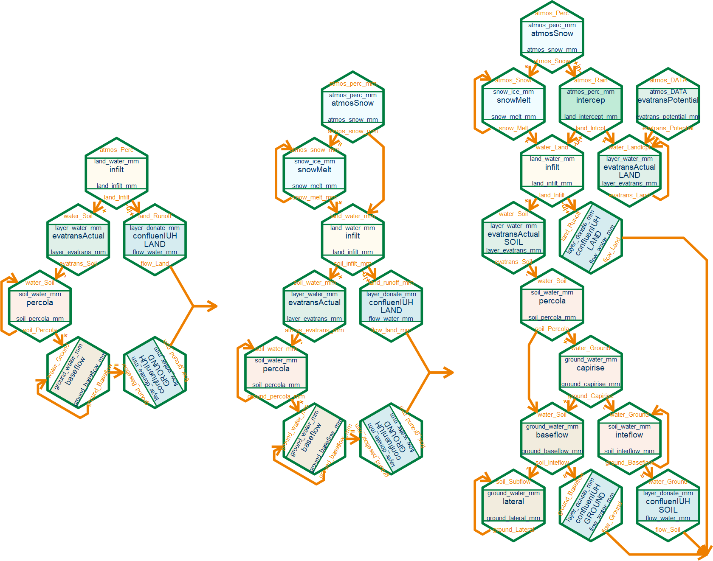

```{r, include = FALSE}
knitr::opts_chunk$set(
  collapse = TRUE,
  comment = "#>"
)
```

```{r setup}
library(EDCHM)
```


# Build a model and calibrate the parameters

The generally way of using the regular model can be described as follows:

1. Select a model that suits your research needs and acquire the necessary software (or script).
2. Prepare the input data and parameters and ensure they are accurate and complete.
3. Use observed data to calibrate the model's parameters.
4. Validate the optimized parameters by comparing them to known results or other models.
5. Apply the model and its optimized parameter sets to research.

But in EDCHM, you need to at first build a model. The process of building a model is an intricate and nuanced task. 
It requires a deep understanding of the system of hydrological modelling to ensure that every component (process) is properly integrated and optimized.

1. Identify the essential processes involved in your research.
2. Organize and connect these processes in a logical sequence that reflects the real-world system and the data-flow.
3. Select the appropriate method (module) for each process, taking into account the specific requirements and constraints of your research.
4. Assemble the model script using the chosen modules, and compile it into a working model that can be tested and refined.

By following this approach, you can create a custom-built model that is tailored to your specific research needs, 
and that can be easily adjusted and updated as new information becomes available.


**BUT** despite the complexity of building a model, EDCHM also offers powerful tools `build_modell` that make the process more straightforward and efficient. 
EDCHM has defined a well-organized structure, so you just need to choose some necessary process and a method for every process. 
Once you have chosen your processes and methods, `build_modell` will automatically generate a model script, and it includes all the input arguments. 
In the same time it will also return the parameter ranges that are needed for calibration and validation.

In the standard structure, there are twelve processes available for selection. 
However, you can also choose to use only a subset of these processes, such as the six minimal processes. 
Certainly, you are not limited to the standard or minimal structures when building a model with `build_modell`. 
Instead, you have the freedom to choose any combination of processes that are relevant to your research.

The mininal-, snow- and standard-structure are showed in the fowling figure:



`EDCHM` offers also three compiled models `EDCHM_mini`, `EDCHM_snow` and `EDCHM_GR4J`.

- `EDCHM_mini` and `EDCHM_snow` has used the mininal- and snow-structure with random method.
- `EDCHM_GR4J` is just the GR4J from EDCHM version,
The results produced by `EDCHM_GR4J` have been verified against the original `airGR::RunModel_GR4J()` implementation of the GR4J model, from `airGR`.

Overall, `build_modell` offers a flexible and customizable approach to building models, allowing you to create a model that is tailored to your specific research needs and requirements.
More details goto section `build_modell`.


After building the model, we can proceed to calibrate its parameters. 
Typically, we need to evaluate the simulated results with observations to do this. 
We can use the `hydroGOF` package, which offers many goodness-of-fit (GOF) functions, such as the Nash-Sutcliffe efficiency (NSE) and Kling-Gupta efficiency (KGE). 
We still need an **evaluation function**, which takes the parameters as input and produces the evaluation results as output. 
These inputs and outputs are then given to a calibration algorithm function, which decides the next set of probe parameters based on the result of the GOF.

The evaluation function is more flexible because it depends on whether the parameters are lumped or distributed, 
whether all or some of them need to be calibrated, and whether they are directly measured or calculated from categorical data such as soil class and land use. 
EDCHM does not offer an evaluation function, but it is not difficult to create one.

EDCHM offers two calibration algorithm functions: `cali_DDS()` \insertCite{DDS_Tolson_2007}{EDCHM} and `cali_UVS()`. 
`cali_DDS()` is very powerful and recommended for most cases. 
`cali_UVS()` is recommended for specific tasks and is a very original algorithm. 
For more details, see the `cali` section of the documentation.
